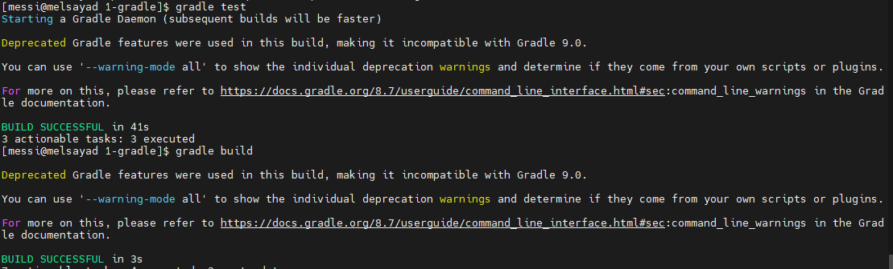
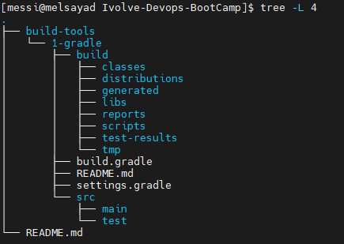

<<<<<<< HEAD
# Ivolve DevOps Bootcamp

## Overview
This repository contains DevOps labs:

- Build Tools (Gradle, Maven)
- Docker
- Kubernetes
- CI/CD
- Ansible

## Current Progress
- Build Tools → In progress
=======
# Lab 1 - Gradle Java Application

---

## 1. Project Structure


---

## 2. Run Unit Tests


---

## 3. Build Project


---

## 4. Generated JAR File


---

## 5. Final Result


---

## Commands Used

```bash
gradle clean
gradle test
gradle build
>>>>>>> 9c7b71d (Add clean README with screenshots)
